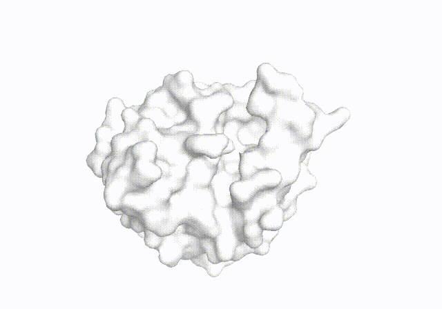

# [EPMolGen: A Deep Generative model which explicitly considers the electrostatic feature of target proteins]

  

## 🔔 EPMolGen

**Implementation of EPMolGen, by Zhenyu Yang.**

**This repository contains all code, instructions and model weights necessary to generate molecules which explicitly considers the electrostatic features of the protein target.**

Traditionally, Some models have been able to generate molecules that are chemically valid. However, their capacity to generate bioactive molecules remains limited. Additionally, few models have been used for actual drug discovery. Many causes might contribute to this problem, and neglecting the electrostatic features of protein target in the molecular generation process could be the major one. Major interactions betwen protein and ligand which contribute to the affinity, such as lonic bond, hydrogen bond, π-π interaction, are strongly related to electrostatic features of protein target. They are the most important factors of physical knowledge which have not yet been considered in deep molecular generative model.

### Requirements:  
Basic requirements:
* Python 3.10.14
* pytorch 2.2.1+cu118
* Pytorch_Geometric 2.5.3
* RDKit==2023.09.6
* PyMol
* OPLS4 Force Field   
* numpy==1.26.4 
    
Aditional requirements:    
Please see requirements.txt

### We prepared several examples as appetizers for users , users can follow these scripts to use EPMolGen as a drug design Tool.
1. Please setup the env dependencies
2. See the following steps   

🔔 **We have provided examples in the folder Ten_test_cases and YTHDC2 for users to try.**

### Information about training and finetuning

|   Period |   Device  | Dataset  |
|:----------:|:----------:|:----------:|
|  Pretraining  |   1*A800  |   ZINC  |
|  finetuning  |  1*A800  |   Crossdocked2020  |
|  sampling  |   1*RTX4090  |   Any protein targets  |

The devices listed here are what we used in these periods, you can also use other devices but you need to adjust the batch sizes accordingly.       
The pretraining data sets and the fine-tuning data sets are in https://zenodo.org/records/14887548              
**You need to change the raw data sets into .lmdb format for pretraining and fine-tuning.**      
We provide the transform_pretraining_dataset.py file for transforming the pretraining data sets into .lmdb format.     
We also provide the transform_finetuning_dataset.py file for transforming the fine-tuning data sets into .lmdb format.      
After converting the pretraining and fine-tuning datasets into .lmdb format,  you can use pretraining.py or finetuning.py for pretraining and finetuning.     
**Note that a parameter in  ./EPMolGen_model/EP_MolGen.py   "pretraining = True" needs to be changed according to the training stage, if it is the pretraining stage, set  "pretraining = True", else if it is the fine-tuning stage, set "pretraining = False".**      
    
For your convenience, We have provided:     
~~~
The parameters of the trained model: ./model_ckpt.pt     
If you only want to generate molecules, use ./model_ckpt.pt.
~~~

### Typical speed of pretraining, fine-tuning and sampling
|   Period |   Device  | speed  |
|:----------:|:----------:|:----------:|
|  Pretraining  |   1*A800  |   one week |
|  finetuning  |  1*A800  |   one week  |
|  sampling  |   1*RTX4090  |   0.7 seconds for 1 molecule  |

The speed depends on specific devices.      

### Molecular generation
Users could conduct molecular generation using sample_main.py, if users prefer to run the program in the background, users could:    
The parameters in sample_main.py:    
~~~
usage: sample_main.py [--pocket] [--topo] [--ckpt] [--molecule_number] [--name] [--device] [--temp_atom] [--temp_bond] [--num_atom_max] [--pivotal_threshold] [--choose_max] [--bond_length_range] [--print_SMILES] [--root_path] 

optional arguments:
  --pocket,          the pdb file path of pocket in receptor
  --ckpt,        the file path of saved model parameters
  --molecule_number,            the number of molecules to be generated
  --name,        receptor name
  --device,            the name of the device. for example, cuda:x or cpu
  --temp_atom,           temperature for atom sampling
  --temp_bond,           temperature for bond sampling
  --num_atom_max, the max atom number for generation
  --pivotal_threshold,           the threshold of probility for pivotal atom, which means that only the atoms which has its probability larger than this value could be considered as pivotal atom
  --choose_max,           whether choose the atom that has the highest probability as pivotal atom
  --bond_length_range, the range of bond length in molecular generation process.
  --print_SMILES, whether print SMILES in molecular generation process
  --root_path, the root path for saving results

~~~

### What you need
the pdf file of the target protein pocket, the topology file of the target protein pocket and the model parameter file are needed, and the rest of the parameters are not mandatory.

You can simply do this:    
~~~
python sample_main.py
~~~

Please see sample_main.py if you want to adjust any hyper-parameters, it's pretty straight-forward.

### Prepare target protein
Protein preparation is based on OPLS4 force field. Users could conduct protein preparation using Protein Preparation in Schrödinger, the file should be saved in ".mae" format.    
You can use other force fields for protein preparation, but the charge of every amino-acids should be partial charged. You should customize the  ./tools/process_residues.py files accordingly.

### Spliting Pocket
In order to train and generate molecules in a more effiicient way, we only use the protein pocket of the target protein, the protein pocket could be obtained based on the original ligand.    
~~~python
from EPMolGen import Ligand, SplitPocket  
from EPMolGen.utils.parse_pdb import Protein
a = Protein("./protein_prepared.mae", compute_ss= False)
l = Ligand("./ligand_kekulized.sdf")
result_dict,result_pocket = SplitPocket._split_pocket_with_surface_atoms(a,l,10)
result_dict_string = str(result_dict)
with open("./protein_topo.dict", "w") as f:
    f.write(result_dict_string)
with open("./protein_pocket10.pdb", "w") as f:
    f.write(result_pocket)
~~~

### Wet-lab experiment
If you want to design drugs on YTHDC2 for appetizer, we have provided the detailed information in the ./YTHDC2 folder.    

### Dataset
We applied [ZINC 3D](https://zinc.docking.org/tranches/home/) dataset for pretraining and [CrossDocked2020] for finetuning.    
Users could download ZINC 3D and apply make_pretrain_data.py to produce the pretraining dataset.    
The raw [CrossDocked2020](https://bits.csb.pitt.edu/files/crossdock2020/) dataset is too large, which need about 50G disk space.     
We have provided the preprocessed data for pretraining and fine-tuning at Zenodo: https://zenodo.org/records/14887548      
For the validation dataset, please see the folder ./Ten_test_cases, we have provided the protein pockets and their topology files in that folder.    